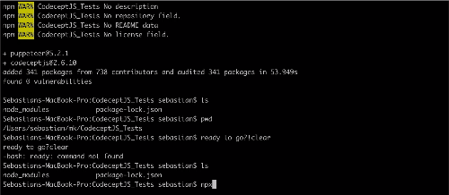

# Moqui Donation Form CodeceptJS Puppeteer Test

## Prerequisites:

Create Donation form by following steps in README.me of https://github.com/sebtedesco/donationForm

#### Getting Started with 

1. In terminal, cd into moqui-framework
2. Create folder named CodeceptJS_Tests

    ```shell
    mkdir CodeceptJS_Tests
    ```
3. cd into CodeceptJS_Tests

    ```shell
    cd CodeceptJS_Tests
    ```
4. Install Codecept Puppeteer

    ```shell
    npm install codeceptjs puppeteer --save-dev
    ```
5. Initialize CodeceptJS in current directory

    ```shell
    npx codeceptjs init
    ```
5. Initialize CodeceptJS in current directory
5. Initialize CodeceptJS in current directory

    ```shell
    npx codeceptjs init
    ```
5. Initialize CodeceptJS in current directory



6. in IDE, navigate to donation_test.js and update file with matching file in this repository

7. In CodeceptJS)_Tests create a file named data.js and update file with matching file in this repository

8. In terminal cd into moqui-framework directory and clean all

    ```shell
    npx codeceptjs init
    ```
9. Load and run donation form project

 ```shell
    ./gradlew load
    ./gradlew run
    ```
10. In separate Terminal window, navitage to CodeCeptJS_Tests directory and run the following command to run the test

 ```shell
    npx codeceptjs run donation_test.js --steps
 ```
